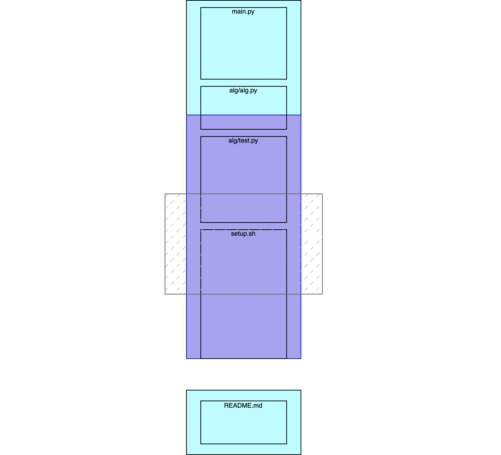

# React web-app for git diff

> Mostly inspired by GitHub, based on VKUI. But dynamic.

## Demo

https://github.com/evermake/git-diff-view-react/assets/53311479/d72dccbf-0ed3-4ae0-a45e-ad70210c116e

## Logic diagram

## Project setup

0. Install `pnpm`
1. Install dependencies: `pnpm install`
2. Copy `.env.example` to `.env`, configure settings (API base URL, specifically)
3. Run development server: `pnpm dev`
4. Build for production: `pnpm build`
5. Preview production build: `pnpm preview`
